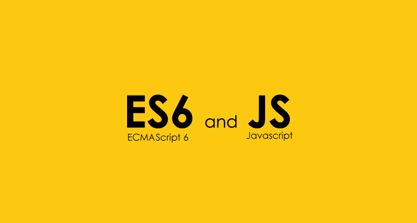

<h2> Crashing into Javascript </h2>

The crash course helped introduce introduce Javascript syntaxes, from past Java and C++ coding knowledge. It helped me depict and identify the new attributes and changes from my previous knowledge. The first 70 % were easy that it only took a few minutes to complete, but past that threshold took alot more time to comprehend the material. Objects I had the hardest time understanding and learning, 2nd being recursion.

An example to being allowed to store different data types in a variable. 
```java
int allowed[] = {0,1,2,3}; // allowed
int not-allowed[] = {"not", function(), 23}; // not allowed
```
```javascript
const allowed = [1,2,3]; // allowed
let alsoAllowed = ['not', function(), 23]; //allowed
```

<h2> Upgrading to ECMAScript </h2>
For the ES6 part of the course, I spent a more time on each section of the course to comprehend the new features for Javascript. I oftenly got stuck in the last 30 % of 1st course and entirety of ES6 course. This is because there were often questions where it was hard to identify what was being asked for. So I would often look at the hints provided, and search up YouTube videos to understand the new features.

<h2> Running the Brain </h2>
Putting what we learned into practice, "Work-outs of the Day" (WODs) allows us to work-out a coding problem. It also applies pressure and stress by being ranked on the time it takes to solve the problem, simulating software engineering problems during job interviews.
