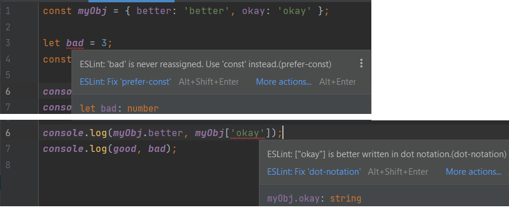

## What are Coding Standards?
Coding standards assist in the development of less complex software systems, helping to reduce errors. If software engineering standards are followed, the code is consistent and easy to maintain because anyone can understand and modify the code at any time.

## Learning Coding Style
Looking back to when I first started to code using block coding, the organization of the code was very unclean and messy. In my codes for ICS 111, the code was organized a little better, but there are many style errors that can be fixed to make it nicer and easier read. Being introduced to commenting in ICS 111 and "<a href="http://courses.ics.hawaii.edu/ics211s21/morea/010.introduction/reading-java-coding-standard.html">ICS Java Coding Standard</a>" in ICS 211 helped explain, organize, and write cleaner codes. In ICS 212, we utilized Vim, a text editor with very primal editing, on unix. The class had strict coding style to follow, but it was very beneficial, allowing us to be more consistent and cleaner with coding files. (<a href="https://github.com/Louie808/Louie808.github.io/blob/master/images/ICS212_hw8_code_style.png">code file screenshot example of C/C++ ICS 212 file and method commenting</a>)

## Intellij and ESLint First Impressions
Being a completely new IDE, I had some difficulty setting up the project paths and folders in my file explorer. Installing ESLint was difficult at first because only after did I realize that for ESLint to run, the three files needed to install must be in the same folder/directory as the files you are going to use the inspection on.

While ESLint is enabled and I first begin to write code, many red lines appeared. I find it very distracting to have to see those lines at the beginning and I want to fix it right away. It is bad practice, but I would end up enabling the ESLint after solving the coding question to modify code to meet the coding standards.

ESLint often marks me when I declare non-reassigned variables with "let" and when I use dot bracket notation to access object values. When the variable value is never reassigned in the code, the tool wants the variable to be a constant. The tool says that it is better written when accessing an object value using dot notation, unless a string key is used in bracket notation, the tool won't mark.

## Final Thoughts
Other than that, I find using ESLint very useful helping me catch my writing style errors and cleaning the code up. When we do the group project for ICS 314, coding standards should be enforced because everyone writes code in their own unique way, and with it established, updating/modifying/editing others' code will be easier. It is an underrated aspect of a project that is not realized until much larger build projects are done by many people.
