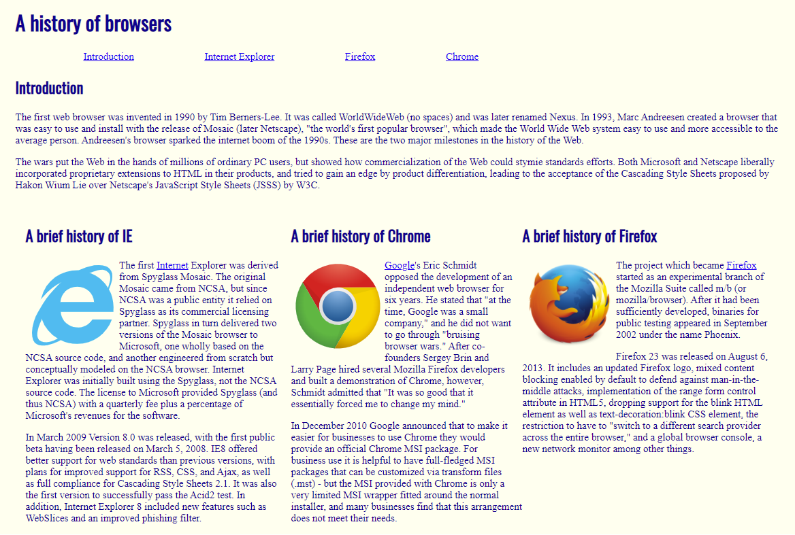
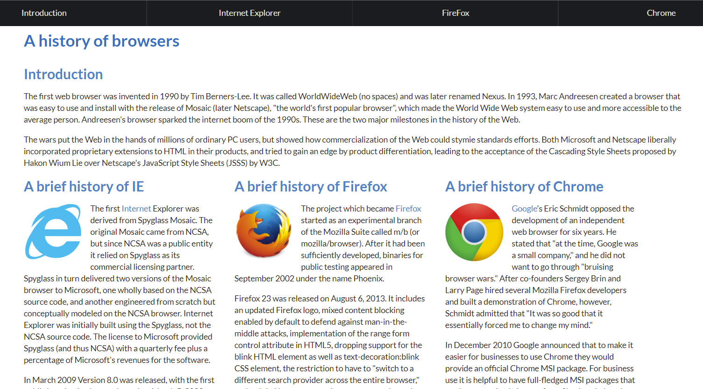

## Deep Dive

  

    Raw HTML and CSS Version
  

    

Prior to Software Engineering (ICS 314), I had attempted to watch a YouTube <a href="https://www.youtube.com/watch?v=pQN-pnXPaVg">HTML Full Course</a> but was hard for me to soak it all in at once. In 314, I started to wet my feet more with HTML and CSS to create a website from scratch. My first creation was the <a href="https://github.com/Louie808/browserhistory">browser history assignment</a>. I have come to understand these languages alot more in the past two weeks of learning UI design. This enabled me to be able to understand the source code behind a website, looking through all the div containers and elements.

## Semantic Swim

  

    Semantic UI Version
  

    

The introduction of semantic was a confusing and a trouble-some first experience. Rewriting the browser history page with semantic was not hard, but there was increased difficulty when recreating a website with many div containers. In the two images I provided using semantic ui to wrap with a ribbon label, is a raw html and css version and a semantic ui version.

   
