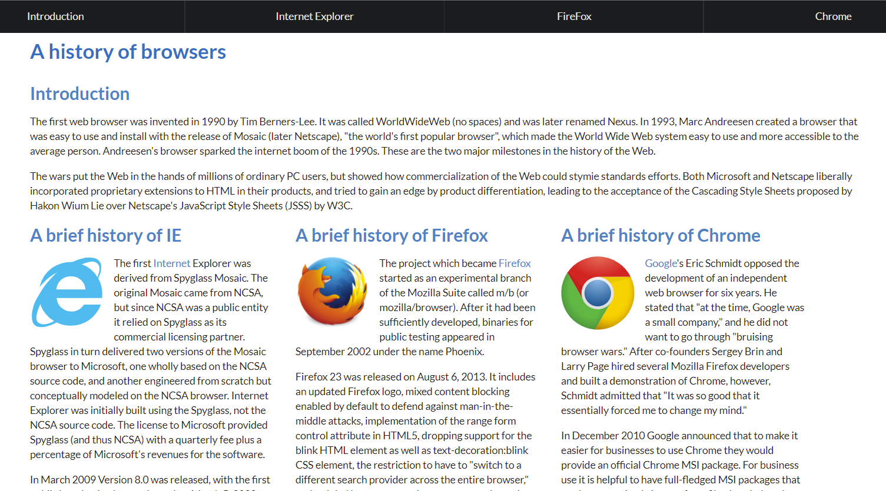
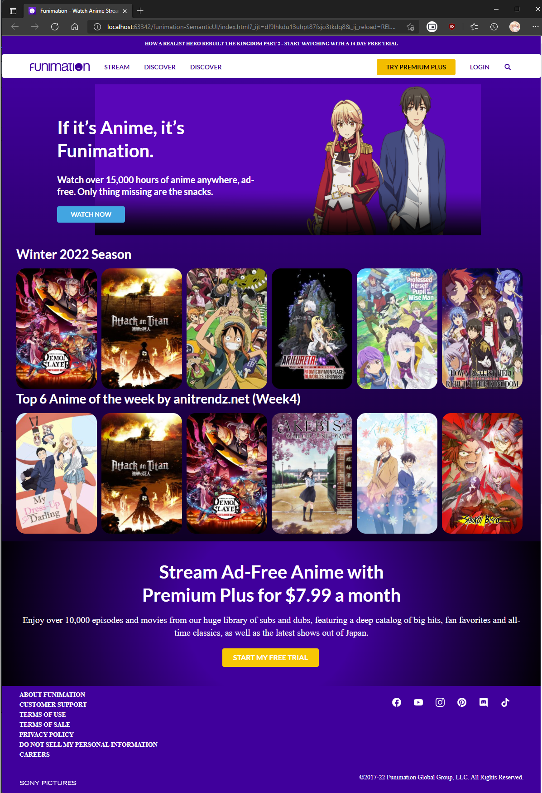

## Deep Dive
Prior to Software Engineering (ICS 314), I had attempted to watch a YouTube <a href="https://www.youtube.com/watch?v=pQN-pnXPaVg">HTML Full Course</a> but was hard for me to soak it all in at once. In 314, I started to wet my feet more with HTML and CSS to create a website from scratch. My first creation was the <a href="https://github.com/Louie808/browserhistory">browser history assignment</a>. I have come to understand these languages alot more in the past two weeks of learning UI design. This enabled me to be able to understand the source code behind a website, looking through all the div containers and elements.

  

    

      

        Raw HTML and CSS Version
      

      
    

  

  

    

      

        Semantic UI Version
      

    

  

## Semantic Swim

The introduction of semantic was a confusing and a trouble-some first experience. Rewriting the browser history page with semantic was not hard, but there was increased difficulty when recreating a website with more div containers. In the two images I provided using semantic ui to wrap with a ribbon label, is a raw html and css version and a semantic ui version. The most distinct differences is that in the Semantic UI, there is a navigation bar menu at the top with making it much easier to click. Next is the containers for the three columns is equally same width and flows more easily when resizing the window. 

## Semantic Deep Dive
In ICS 314, the assignment was to recreate any webpage of our choosing, I choose the <a href="https://www.funimation.com/">Funimation</a> website. I had a lot of fun reacreating this page and never crossed my mind before that I could make my own replica of a site. Within the two weeks of learning HTML and CSS I was able to replicate the website. Although my code contains a lot of div containers, I did not have a complete understanding of the ui semantic grid and container. With more practice with HTML, CSS, and Semantic UI, I can reduce the lines of codes needed to replicate, not only <a href="https://www.funimation.com/">Funimation</a>, but many other sites.

  

    <a style="text-decoration: none;" class="ui label" href="https://github.com/Louie808/funimation-SemanticUI"><i class="large github icon"></i>Link to Funimation recreation Code</a>
  

    

   
