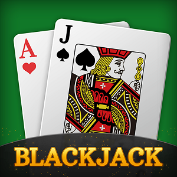
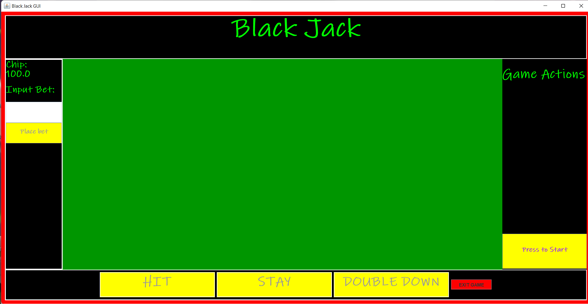
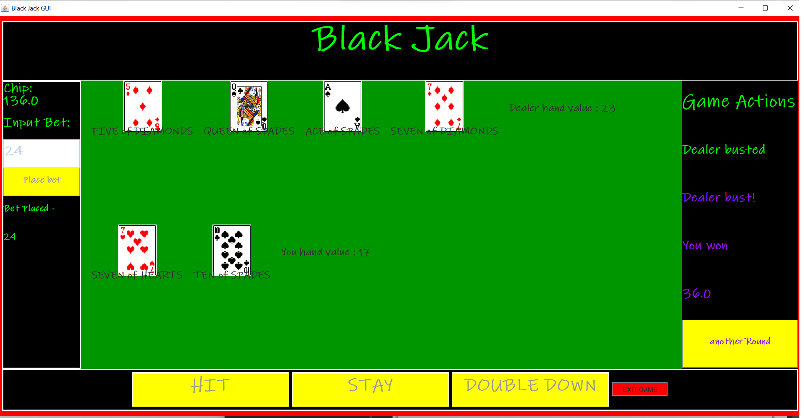

<h1>Black Jack GUI</h2>

This Black Jack GUI was my final project for ICS 111, where I learned the basics of Java. The purpose of this project was to put to practice the knowledge gained from the class. At first I made a console version of the game, and after finishing that I transformed it into a graphic-user-interface(GUI).


This was a individual project, although the TA gave a folder with pngs of the entire deck of cards, which improved graphics allowing virtual cards to be displayed to the board. I made use of JFrames, JPanels, JLabels, JButtons, and other classes to be able to design and color my graphical-user-interface. It was very exciting to code each new game option and update the window for users. Although actual game-logic was very simple, it was making the interface, which was long but fun.


Source: <a href = "https://github.com/Louie808/Black_Jack_GUI"><i class="large github icon"></i>Louie808/Black_Jack_GUI</a>.

<div style="display:center">
  
  
</div>
<h3>Code for just setting up the interface</h3>
```java

    public blackJack_GUI_Version(){
		setFonts();
		decks = new java.util.ArrayList<deck>();
		
		game_frame = new JFrame("Black Jack GUI");
		
		game_frame.setSize(new Dimension(1550,800));
		game_frame.setResizable(true);
		game_frame.setDefaultCloseOperation(JFrame.EXIT_ON_CLOSE);
		
		contents = new JPanel();
		contents.setLayout(new BorderLayout());
		contents.setBorder(borderContents);
		contents.setBackground(colorContents);
		game_frame.setContentPane(contents);
		
		//Creation of panels and their methods
		createTitlePanel();
		createMoneyPanel();
		createBetPanel();
		createOptionPanel(3);
		createActionPanel();
		createPlayField();//cards_panel
		
		//add panels
		contents.add(cards_panel, BorderLayout.CENTER);
		contents.add(title_panel, BorderLayout.NORTH);
		contents.add(bet_panel, BorderLayout.WEST);
		contents.add(option_panel, BorderLayout.SOUTH);
		contents.add(action_panel, BorderLayout.EAST);

    //reset button used for testing the reset method
		reset = new JButton("RESET");
		reset.setVisible(true);
		reset.setFocusable(false);
		reset.setBackground(Color.RED);
		reset.addActionListener(e-> resetBoard());
		//Exit button
		exit = new JButton(" EXIT GAME ");
		exit.setVisible(true);
		exit.setFocusable(false);
		exit.setBackground(Color.RED);
		exit.addActionListener(e-> System.exit(0));
		option_panel.add(exit, BorderLayout.EAST);
		
		pack();
		game_frame.setVisible(true);
		createDecks();
	}```
