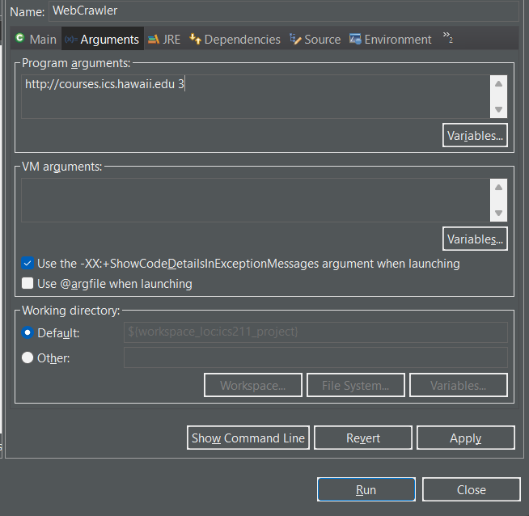
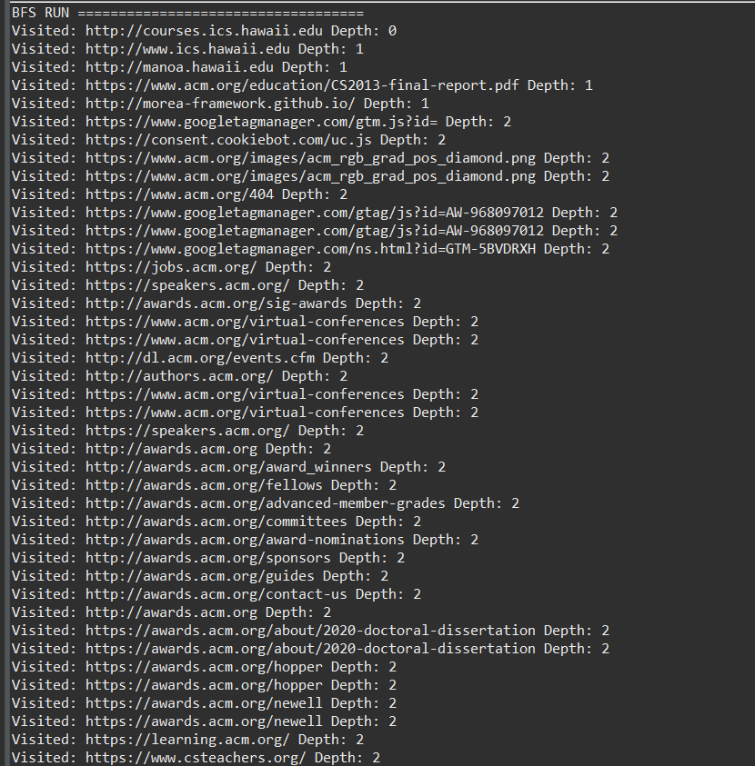
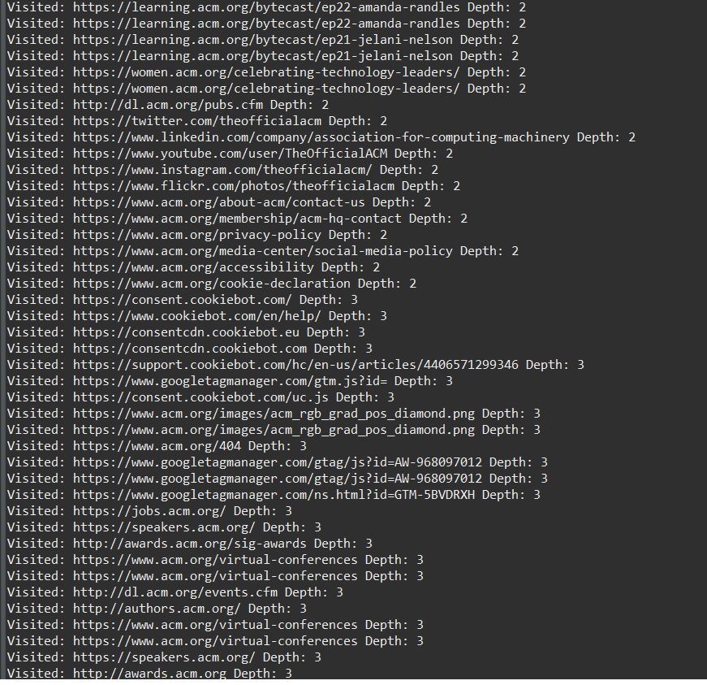
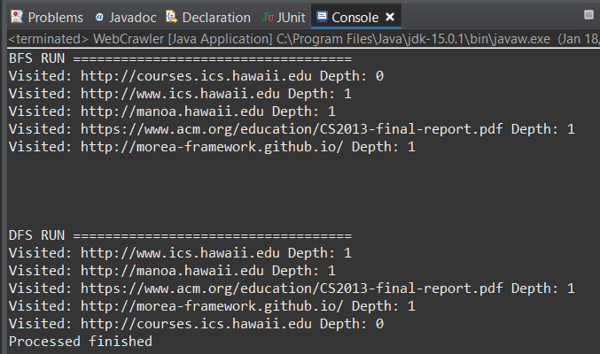

This simple webcrawler is a java program that takes commandline URL argument and prints out to the console the list of websites that are discovered to the depth specified in the command argument. This was my first project where I worked with others and collaborated to make the code function.

During the process of this project, we mapped out the general design for the code. We made pseudocodes for the essential methods of the code such as the validate links and

Source: <a href = "https://github.com/Louie808/Black_Jack_GUI"><i class="large github icon"></i>Louie808/Black_Jack_GUI</a>.

  
  Command line argument
  
  
  
  start of Breath-First
  
  
  
  Console keeps printing even through depth of 2
  
  
  
  Breath-First and Depth-First
  
  
  

