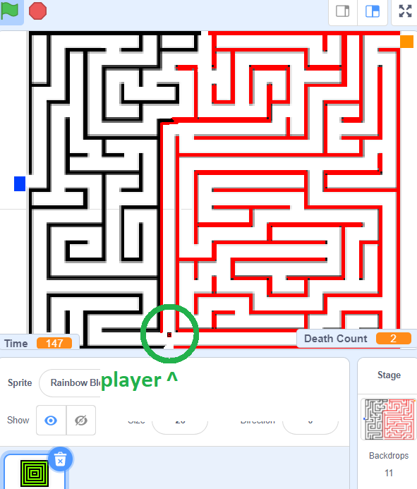
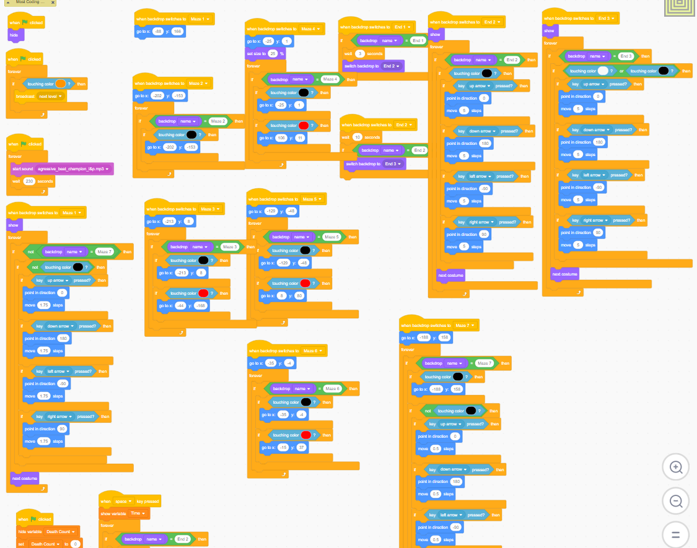

I programmed a 2d maze game using blocks coding for a STEM class, which was also entered for the in-class tournament placing 3rd in a class of 30. The STEM teacher just assigned the class to make a game and submit, knowing that most of us knew nothing about programming. It is a simple maze game where you control the small square and manuever through the maze, and as you progress, each stage gets more difficult and challenging.

This was a individual project using a sprite lab. Sprite Lab is a block-based programming environment that allows you to create basic animations and games using interconnected objects and characters. Create a game or animation, then share it in a matter of seconds. There was many details I added like a death count, timer, and music. Simple arrow-key input was used to control the sprite (small square). There is collision mechanics where if the sprite were to touch the walls, the player would restart the level and increment death count if the wall is red.

Player Sprite, Timer, Death count.

  

This was my first time touching code. It was a really fun experience and what led me down the computer science path. It introduced me to object oriented programming, without even knowing, and game development. Looking back at my code, it is messy and I have matured a lot especially since ICS 111. The methods I could make now would be more efficient and would use less lines of code. My code that I write now is much more cleaner and easier to read, thanks to coding style requirements for ICS 211 and ICS 212.

Source: <a href = "https://github.com/Louie808/8thGrade_ScratchGame"><i class="large github icon"></i>Louie808/8thGrade_ScratchGame</a>
#### Most of the blocks for the Sprite.
Scratch game link: <a href = "https://scratch.mit.edu/projects/106124273/">Game LINK</a> (Click "See Inside" to look at code)
  

  

