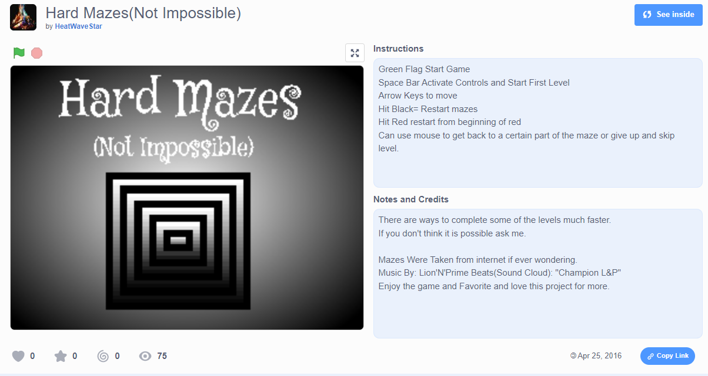

I programmed a 2d maze game using blocks coding for a STEM class, which was also entered for the in-class tournament placing 3rd in a class of 30. STEM teacher just assigned the class to make a game and submit.

Site : <a href = "https://scratch.mit.edu/projects/106124273/">Scratch.Mit

  
  

